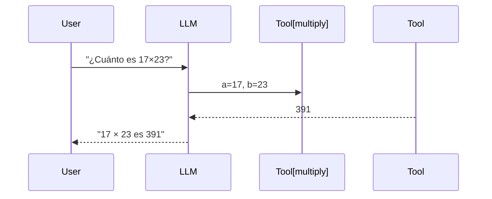

# 🧠 Guía Definitiva de LangChain, LangGraph & LangSmith

**De cero a experto en desarrollo de aplicaciones con LLMs**

---

## 0. Visión global del ecosistema

| Herramienta   | Rol principal                                                       | Cuándo la usas                                                             |
| ------------- | ------------------------------------------------------------------- | -------------------------------------------------------------------------- |
| **LangChain** | Framework base para orquestar LLMs, promts, tools, memory & agents. | Siempre que quieras un MVP, RAG, chat o agente sobre un LLM.               |
| **LangGraph** | Capa de control de flujo basada en grafos (nodos + estado + loops). | Flujos complejos, multi‑agente, recuperación de contexto avanzado.         |
| **LangSmith** | Observabilidad (trazas, métricas, A/B, evaluación).                 | Cuando tu app sale de pruebas y necesitas medir coste, latencia y calidad. |

> **Pipeline ideal**: diseñas con **LangChain**, escalas con **LangGraph** y monitorizas con **LangSmith**.

---

## 1. Fundamentos de LangChain

### 1.1 Componentes clave

| Componente         | Descripción breve                                                       |
| ------------------ | ----------------------------------------------------------------------- |
| **LLM**            | Motor de lenguaje (OpenAI, Gemini, Claude, Ollama…).                    |
| **PromptTemplate** | Plantilla parametrizable para generar instrucciones.                    |
| **Memory**         | Guarda contexto entre turnos (Buffer, Window, Summary, Token).          |
| **Tool**           | Función externa que el modelo puede invocar (APIs, código Python, DB…). |
| **Chain**          | Secuencia de pasos LLM/Tool; puede ser lineal o condicional.            |
| **Agent**          | Entidad que decide dinámicamente qué herramienta usar.                  |

### 1.2 Flujo más simple



---

## 2. Entorno Python & configuración

```bash
python -m venv myenv && source myenv/bin/activate   # Windows: myenv\Scripts\activate
pip install -U langchain langchain-google-genai python-dotenv pydantic
```

`.env`:

```env
GOOGLE_API_KEY=TU_CLAVE_GOOGLE
LANGSMITH_TRACING=true
LANGSMITH_API_KEY=opcional
LANGSMITH_PROJECT=default
```

---

## 3. Hello‑World: Gemini ChatBox con Tools

1. Define `add_func` y `multiply_func`.
2. Publícalas via `Tool.from_function`.
3. Inicializa modelo:

```python
llm = init_chat_model("gemini-2.0-flash", model_provider="google_genai")
llm_with_tools = llm.bind_tools(tools)
```

4. Bucle interactivo: historia `chat_history` + detección `response.tool_calls`.
5. Ejecuta tool y devuelve resultado.

### 3.1 Código completo simplificado

*(para consultas sueltas, sin conversación continua)*

```python
# versión minimal (solo invoke simple)
# ... (se mantiene)
```

### 3.2 Código completo **interactivo** con Tools + Memoria

Este script te permite conversar libremente con Gemini, mantener historial y ejecutar
herramientas matemáticas en mitad del diálogo.

```python
import os
from dotenv import load_dotenv
from langchain_core.tools import Tool
from pydantic import BaseModel, Field
from langchain.chat_models import init_chat_model
from langchain_core.messages import HumanMessage, AIMessage

# 1 ─ Cargar .env
a
load_dotenv()
google_api_key = os.getenv("GOOGLE_API_KEY")
if not google_api_key:
    raise ValueError("GOOGLE_API_KEY no está definida")

# 2 ─ Config LangSmith (opcional)
os.environ.setdefault("LANGSMITH_TRACING", "true")
os.environ.setdefault("LANGSMITH_PROJECT", "default")

# 3 ─ Tools (add & multiply)

def add_func(a: float, b: float) -> float:
    print(f"➕ {a} + {b} = {a + b}")
    return a + b

def multiply_func(a: float, b: float) -> float:
    print(f"✖️ {a} * {b} = {a * b}")
    return a * b

class AddInput(BaseModel):
    a: float = Field(...)
    b: float = Field(...)

class MultiplyInput(BaseModel):
    a: float = Field(...)
    b: float = Field(...)

tools = [
    Tool.from_function("add", "Suma dos números", lambda x: add_func(**x), AddInput),
    Tool.from_function("multiply", "Multiplica dos números", lambda x: multiply_func(**x), MultiplyInput),
]

# 4 ─ LLM + binding
llm = init_chat_model("gemini-2.0-flash", model_provider="google_genai")
llm_with_tools = llm.bind_tools(tools)

tool_map = {"add": add_func, "multiply": multiply_func}
chat_history = []  # almacena HumanMessage / AIMessage

print("
🤖 Gemini ChatBot activo — escribe 'salir' para terminar
")
while True:
    user = input("🧑 Tú: ").strip()
    if user.lower() in {"salir", "exit", "quit"}:
        break

    chat_history.append(HumanMessage(content=user))
    response = llm_with_tools.invoke(chat_history)

    if getattr(response, "tool_calls", None):
        print("🛠 Herramienta(s) solicitada(s):")
        for call in response.tool_calls:
            name, args = call["name"], call["args"]
            result = tool_map[name](**args)
            print(f"✅ {name}: {result}")
            chat_history.append(AIMessage(content=f"Resultado de {name}: {result}"))
    else:
        print("🤖", response.content)
        chat_history.append(AIMessage(content=response.content))
```

*Puntos clave*: historial de conversación, detección de `tool_calls`, impresión de resultados y memoria viva.

---

## 4. Router Chains: múltiples expertos

### 4.1 Por qué

* Rutea preguntas al experto adecuado (Física, Matemáticas, Historia…).
* Mantiene prompts especializados y resultados coherentes.

### 4.2 Plantilla de Router

```python
router_chain = LLMRouterChain.from_llm(llm, router_prompt)
multi_chain = MultiPromptChain(router_chain, destination_chains, default_chain)
```

### 4.3 Ejemplo de dominios

| Nombre      | Prompt resumido                 |
| ----------- | ------------------------------- |
| **physics** | "You are a physics professor…"  |
| **math**    | "You are a mathematician…"      |
| **history** | "You are a historian…"          |
| **cs**      | "You are a computer scientist…" |

---

## 5. Agentes (ReAct, MRKL, Plan‑&‑Execute)

* **initialize\_agent** para crear agentes reactivos.
* Ciclo *Thought → Action → Observation* permite reasoning step‑by‑step.

```python
from langchain.agents import initialize_agent, AgentType
agent = initialize_agent(tools, llm, agent_type=AgentType.CHAT_ZERO_SHOT_REACT_DESCRIPTION)
```

---

## 6. Memoria avanzada

| Tipo                       | Caso de uso                           | Ventajas                      |
| -------------------------- | ------------------------------------- | ----------------------------- |
| Buffer                     | Chat corto (<4k tokens).              | Sencillo.                     |
| Window                     | Enfoque en los últimos N turnos.      | Evita contexto infinito.      |
| Summary                    | Conversaciones largas (>10k tokens).  | Mantiene gist + reduce coste. |
| TokenBuffer                | Garantiza no exceder límite.          | Control granular.             |
| RunnableWithMessageHistory | API moderna, soporta storage externo. | Escalable.                    |

---

## 7. LangSmith en producción

1. Crea proyecto: `LANGSMITH_PROJECT=my_chatbot`.
2. Activa tracing y analytics.
3. Ver en dashboard: latencia, coste, success rate.
4. Realiza test A/B entre prompts.

---

## 8. Buenas prácticas

* **Nunca** hardcodees claves → usa `.env`.
* Mantén `langchain` actualizado y revisa changelog.
* Usa IDs de modelo vigentes (`gemini-2.0-flash`, `gpt-4o-mini`, etc.).
* Valida la entrada con `Pydantic` para evitar fallos en tools.
* Loguea con LangSmith desde el día 1.

---

## 9. Escalado y despliegue

| Meta                | Recomendación                              |
| ------------------- | ------------------------------------------ |
| **Persistencia**    | Redis (chat\_history), Postgres (RAG docs) |
| **Retrieval (RAG)** | Pinecone, Chroma, FAISS                    |
| **API**             | FastAPI + LangServe                        |
| **Frontend**        | Streamlit, Next.js + LangChain.js          |
| **Infra**           | Docker + CI/CD + monitoring                |

---

## 10. Roadmap de maestría

1. **Fundamentos**: dominar prompts, tools, memory.
2. **Agentes**: ReAct, toolkits, plan & execute.
3. **Router/Graph**: flujos multi‐agente con LangGraph.
4. **RAG avanzado**: embeddings, clasificadores, re‑rankers.
5. **Observabilidad**: métricas, evaluación continua.
6. **Escalabilidad**: microservicios, serverless, shards de vectores.

---

### 📚 Recursos recomendados

* **Docs LangChain**: [https://python.langchain.com/](https://python.langchain.com/)
* **Guía Gemini**: [https://ai.google.dev/docs](https://ai.google.dev/docs)
* **Curso Agents & RAG** (LangChain University).
* **Blog LangSmith** para observabilidad.

---

## 🏁 Conclusión

Con esta guía tienes todo el itinerario: desde instalar LangChain hasta desplegar un agente multi‑herramienta monitorizado en producción. Practica cada bloque, integra herramientas nuevas y experimenta con LangGraph para flujos complejos.

> **Próximo paso:** clona el repo de ejemplo, añade divisiones y potencias como tools y mide trazas en LangSmith.

